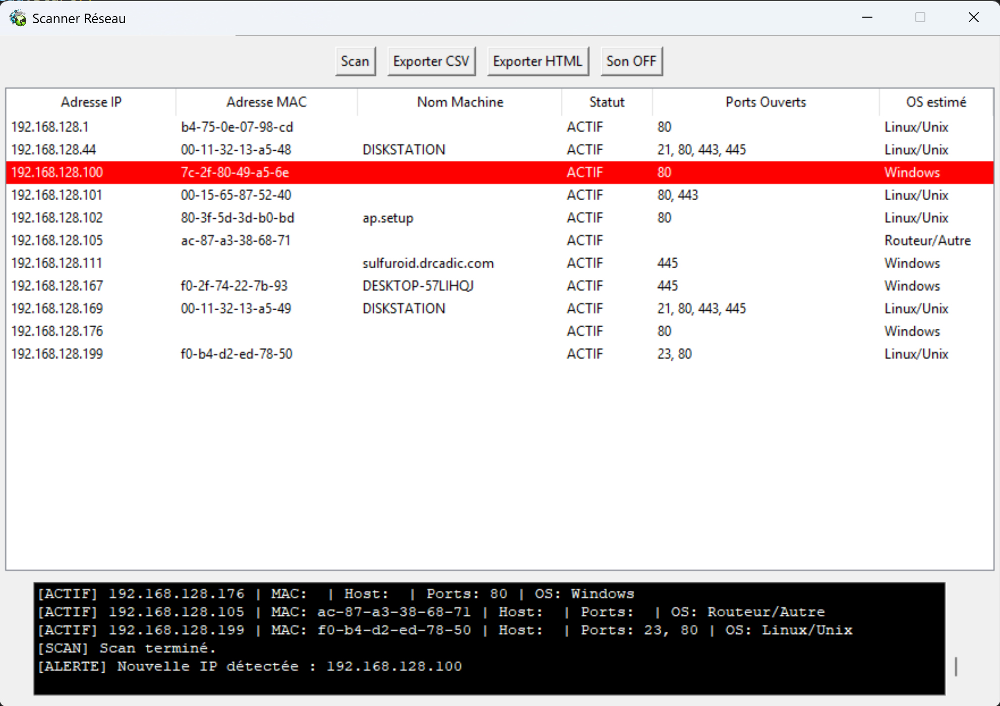

Nom du logiciel : CADScanner6
Version : 1.0
Type : utilitaire réseau – freeware
Système : Windows (x64)
Licence : Gratuit pour une utilisation personnelle et professionnelle

Qu’est-ce que CADScanner6 ?
CADScanner6 est un utilitaire réseau léger et puissant pour Windows, conçu pour analyser en temps réel l’ensemble des appareils connectés à votre réseau local.
Le logiciel est spécialement conçu pour les professionnels, les administrateurs système, ou tout utilisateur curieux souhaitant surveiller son réseau.
 

Fonctionnalités principales
•	 Scan automatique de tout le réseau local (/24)
•	 Scan toutes les 60 secondes pour détecter de nouveaux appareils
•	 Affichage clair et instantané des appareils connectés :
o	Adresse IP
o	Adresse MAC
o	Nom de la machine (hostname)
o	Ports ouverts parmi les plus utilisés (HTTP, SSH, RDP, etc.)
o	Système d’exploitation estimé (Windows, Linux, autres)
•	 Alerte visuelle et sonore en cas de détection d’un nouvel appareil
•	 Interface graphique conviviale avec tableau trié et journal de log
•	 Export CSV et HTML des résultats du scan

By @sulfuroid 
Want to reward in BTC : bc1qwa5aww8frsjj8y8plrwkank64kxhuccr94wku7
